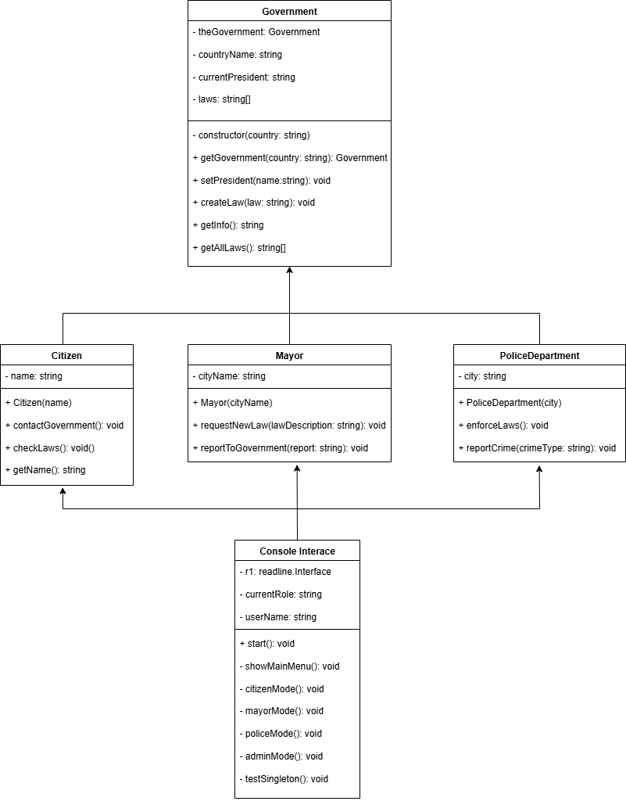

# Singleton Method Design Pattern - TypeScript

A simple implementation of the Singleton Design Pattern using a Government analogy.

## Overview

The Singleton pattern ensures that a class has only one instance and provides a global access point to that instance. This project demonstrates the pattern where there can only be one official government per country.

## Project Structure

```
├── src/
│   ├── models/
│   │   ├── government.ts
│   │   ├── citizen.ts
│   │   ├── mayor.ts
│   │   └── policeDepartment.ts
│   └── main/
│       ├── interactiveMain.ts
│       ├── automaticDemo.ts
│       └── singletonTest.ts
├── package.json
├── tsconfig.json
└── README.md
```

## UML Class Diagram



## Installation and Setup

```bash
# Install dependencies
npm install
```

## Running the Application

```bash
# Interactive demo
npm run interactive

# Automatic demo
npm run demo

# Run tests
npm run test
```

## Core Implementation

### Government Class (Singleton)

```typescript
class Government {
  private static theGovernment: Government;
  private countryName: string;
  private currentPresident: string;
  private laws: string[] = [];

  private constructor(country: string) {
    this.countryName = country;
    this.currentPresident = "No President Yet";
  }

  static getGovernment(country: string = "MyCountry"): Government {
    if (!Government.theGovernment) {
      Government.theGovernment = new Government(country);
    }
    return Government.theGovernment;
  }

  setPresident(name: string): void { ... }
  createLaw(law: string): void { ... }
  getInfo(): string { ... }
  getAllLaws(): string[] { ... }
}
```

## Key Features

- Private Constructor: Prevents external instantiation
- Static Instance Variable: Holds the single instance
- Static Access Method: Provides global access
- Basic Error Handling: Simple input validation

## Usage Example

```typescript
const gov1 = Government.getGovernment("USA");
const gov2 = Government.getGovernment("Canada");
const gov3 = Government.getGovernment();

console.log(gov1 === gov2); // true
console.log(gov2 === gov3); // true
```

## Class Interactions

All classes (Citizen, Mayor, PoliceDepartment) use the same government instance:

```typescript
class Citizen {
  contactGovernment(): void {
    const gov = Government.getGovernment();
    // Interact with government
  }
}
```

## Expected Output

### Test Output

```
=== TESTING SINGLETON PATTERN ===

Government of Country1 established!
gov1 === gov2: true
gov2 === gov3: true
All same object: true

Test President is now the President
New law created: Test Law 1

All governments have same data:
gov1: Country: Country1, President: Test President, Laws: 1
```

## Learning Objectives

This implementation demonstrates:

1. Singleton Pattern Implementation
2. Global Access Control
3. State Sharing
4. Real-world Modeling

## Technical Requirements

- Node.js (version 16 or higher)
- TypeScript (version 5.0 or higher)

## Built by

Ms Hamsini S
